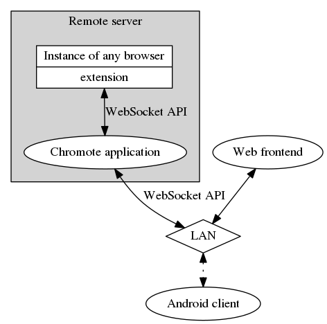

<div class="abstract">
Controlll remote instance of Google Chrome or Chromium via simple API from your phone or browser Designed to use running Chrome(ium) as a HTPC frontend

</div>


# Abstract


## Idea




## Chrome/Chromium setup


### Chromote tabs extension

Exensoion provides API over web socket connection to controll tabs and windows

It should be registered by it's first message

```js
ws = new WebSocket("ws://localhost:8080/browser?token=XXXXXXXX");
ws.onopen = function() {
  ws.send("")
};
```

Extension binds on [each tab action](https://developer.chrome.com/extensions/tabs#events) and updates Chromote with changes Extension binds on incomming messages and perform navigate/activate/close/open/refresh by tabID


### Example tab object

```js
{
    "active": true,
    "audible": false,
    "autoDiscardable": true,
    "discarded": false,
    "favIconUrl": "https://www.redditstatic.com/favicon.ico",
    "height": 653,
    "highlighted": true,
    "id": 45,
    "incognito": false,
    "index": 9,
    "mutedInfo": {
      "muted": false
    },
    "pinned": false,
    "selected": true,
    "status": "complete",
    "title": "The \"Origin not allowed\" error. : golang",
    "url": "https://www.reddit.com/r/golang/comments/2j0v46/the_origin_not_allowed_error/",
    "width": 1360,
    "windowId": 1
}
```


# Architecture


## Chromote API endpoints:

| url           | params  | action                                                                                         |
|------------- |------- |---------------------------------------------------------------------------------------------- |
| GET: /        |         | get browser client/see all the public hubs. Also provides downloads                            |
| GET: /client  | **key** | pregister a new client and open a ws connection to it                                          |
| GET: /browser |         | register a browser by it's first message, containing **key** and create a Hub for this browser |


## Client

Client connects to a webscoket by providing a **key**, previously generated by browser extension Connection fails if no Hubs available/no Hubs with provided **key** available

Client sends **commands** and recieves **notifications** Command example:

```js
{
  targetId: 42, // target tab id
  action: "nvaigate", //one of tab's actions
  params: {
      url: "http://linux.org.ru" //parabms for action, if needed
  }
}
```


## Browser

Connects to a browser websocket and initializes a Hub with provided **key**

Browser gets **commands** and sends **notifications** Notification is an array of Tab objects or an error msg


## Hub

Hub consists of one browser and many clients. Hub routes commands from clients to browser and updates clients with latest tabs state Clients should register with some kind of auth, e.g. passphrase, generated by browser extension. Hub also holds \`Tabs []\*Tab\` object with map of all browser's tabs.


## Tab

Fields:

-   *active*
-   *audible* show speacker icon
-   *pinned* show pin icon
-   *favIconUrl* show favIcon
-   *id* 45
-   *incognito* show mask icon
-   *index* just index in chrome
-   *muted* controll mute/unmute
-   *status* show/hide spinner
-   *title*
-   *url*
-   *windowId* group tabs by windows

Available methods:

-   *Nvaigate* to an {URL}
-   *Close*
-   *Reload*
-   *Activate* - switch to this tab in view
-   *Open* opens a new Tab with {URL}
-   *toggleMute*
-   *ZoomIn|ZoomOut|zoomRestore*

Tab is being changed by method and then corresponding JSON command composed and being sent to **tx**

Update tabs on **rx** by browser responce being unmarshalled


## Comuncation protocol

1.  Client sends command
2.  Command is being unmarshalled and marshalled to JSON (fore security reasons), cliens list appended
3.  Command is being sent to Browser along with client list
4.  Browser performs actions and responses with tabs list and command result (error||succes)
5.  Tabs being updated
6.  broadcast Tabs to clients

It is possible to start from #3 in case of external browser update (e.g. by mouse/keyboard)

Extension (brwoser) generates hash *[a-z0-9]{8}* and sends it via GET with first request. Clients should register on the Hub by this key.


## Extension

It has two parts: . background.js - all the logic of extension . index.js - code for the extension's popup

They do comunicate via *chrome.extensionsendMessage*


# thigs to be done:

| where                            | what                                               |
|-------------------------------- |-------------------------------------------------- |
| views/client.html:30:12:         | emit event to websocket                            |
| views/client.html:46:12:         | bind all other functions                           |
| views/client.html:49:12:         | store all tabs sorted by tab.index                 |
| views/client.html:59:14:         | implement two way data binding                     |
| hub.go:53:6:                     | validate command & append clients list             |
| hub.go:63:6:                     | update Tabs struct                                 |
| chrome-ext/index.js:32:6:        | for each client build table                        |
| chrome-ext/background.js:1:4:    | can we move to ES6?                                |
| chrome-ext/background.js:4:3:    | add callbacks for each action to get tabs.         |
| chrome-ext/background.js:61:68:  | change signature, add cb                           |
| chrome-ext/background.js:78:6:   | store URL in store; configure it via settings page |
| chrome-ext/background.js:115:11: | all other tab events                               |
| chrome-ext/background.js:150:4:  | on store.hash update - drop connection             |
